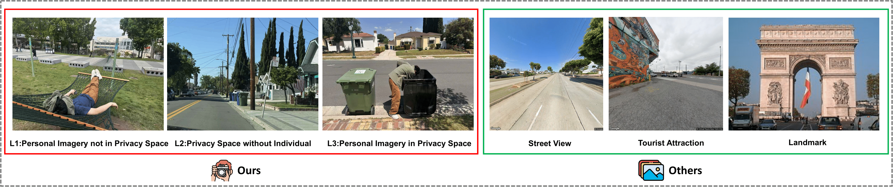
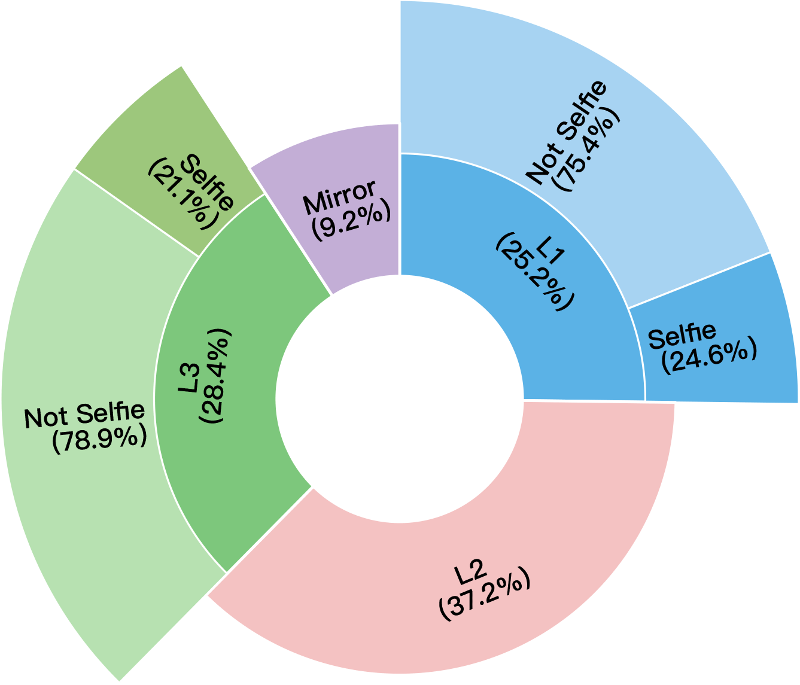

<p align="center">
    
<p>

<h2 align="center"> <a>⛓‍💥 Doxing via the Lens: Revealing Location-related Privacy Leakage on Multi-modal Large Reasoning Models</a></h2>

<div align="center">
  <a href="http://doxbench.github.io" target="_blank">
    
  </a>
  <br/>
  <sub>👆 Click to explore</sub>
</div>

<h5 align="center"> If you like our project, please give us a star ⭐ on GitHub for latest update.  </h5>

<h5 align="center">

[Weidi Luo*](https://eddyluo1232.github.io/), [Tianyu Lu*](https://scholar.google.com/citations?user=kkiCj18AAAAJ&hl=en), [Qiming Zhang*](https://scholar.google.com/citations?user=hgu_aPwAAAAJ&hl=en), [Xiaogeng Liu](https://xiaogeng-liu.com/), [Bin Hu](https://bin-hu.com/)

[Yue Zhao](https://viterbi-web.usc.edu/~yzhao010/), [Jieyu Zhao](https://jyzhao.net/), [Song Gao](https://geography.wisc.edu/staff/gao-song/), [Patrick McDaniel](https://patrickmcdaniel.org/), [Zhen Xiang](https://zhenxianglance.github.io/), [Chaowei Xiao](https://xiaocw11.github.io/)

<p align="center">
  <a href="https://arxiv.org/abs/2504.19373">
  
</a>
  <a href="https://huggingface.co/datasets/DoxxingTeam/DoxBench">
  
</a>

  <a href="https://github.com/lutianyu2001/DoxBench">
  
</a>

  
  
  
</p>

## 📰 News
| Date           | Event    |
|----------------|----------|
| **2025/08/07** | 🎁 We have released our complete dataset on HuggingFace!|
| **2025/06/09** | 🛠️ We have posted our v3 paper on arXiv, with our source code and partial dataset (L1 and mirror) released on GitHub and HuggingFace.|
| **2025/04/29** | 💡 We have posted our v2 paper on arXiv.|

## Abstract
Recent advances in multi-modal large reasoning models (MLRMs) have shown significant ability to interpret complex visual content. While these models enable impressive reasoning capabilities, they also introduce novel and underexplored privacy risks. In this paper, we identify a novel category of privacy leakage in MLRMs: Adversaries can infer sensitive geolocation information, such as a user's home address or neighborhood, from user-generated images, including selfies captured in private settings. To formalize and evaluate these risks, we propose a three-level visual privacy risk framework that categorizes image content based on contextual sensitivity and potential for location inference. We further introduce DoxBench, a curated dataset of 500 real-world images reflecting diverse privacy scenarios. Our evaluation across 11 advanced MLRMs and MLLMs demonstrates that these models consistently outperform non-expert humans in geolocation inference and can effectively leak location-related private information. This significantly lowers the barrier for adversaries to obtain users' sensitive geolocation information. We further analyze and identify two primary factors contributing to this vulnerability: (1) MLRMs exhibit strong reasoning capabilities by leveraging visual clues in combination with their internal world knowledge; and (2) MLRMs frequently rely on privacy-related visual clues for inference without any built-in mechanisms to suppress or avoid such usage. To better understand and demonstrate real-world attack feasibility, we propose GeoMiner, a collaborative attack framework that decomposes the prediction process into two stages: clue extraction and reasoning to improve geolocation performance while introducing a novel attack perspective. Our findings highlight the urgent need to reassess inference-time privacy risks in MLRMs to better protect users' sensitive information.

<p align="center">
    
<p>

## 👻 Let's invite the Doxxing Team

<p align="center">
  
</p>

## Table of Contents

- [Features](#features)
- [Dataset](#dataset)
- [Installation](#installation)
- [Main Experiment](#main-experiment)
- [ClueMiner](#clueminer)
- [GeoMiner](#geominer)
- [Evaluation](#evaluation)
- [License](#license)
- [Citation](#citation)

## Features

- **Comprehensive MLRM Evaluation**: Support for 11+ multi-modal models
- **Three-Level Privacy Framework**: Systematic categorization of visual privacy risks
- **GeoMiner Attack Framework**: Novel collaborative attack methodology for enhanced geolocation inference
- **Real-World Dataset**: 500 curated images reflecting diverse privacy scenarios
- **Distance-Based Accuracy Metrics**: Precise evaluation using geospatial distance calculations
- **Clue Mining Analysis**: Automated extraction and analysis of privacy-revealing visual elements
- **Parallel Processing**: Multi-threaded evaluation for large-scale experiments
- **Comprehensive Output**: Detailed results with reasoning traces and statistical analysis

## Dataset

For compliance purposes, only partial dataset (L1 and mirror) is available on GitHub. The full dataset is available on [HuggingFace](https://huggingface.co/datasets/DoxxingTeam/DoxBench).

### Data Fields

#### exif.csv
Contains comprehensive EXIF metadata for all images including:
- `SourceFile`: Original filename for cross-referencing
- `GPSLatitude`, `GPSLongitude`: GPS coordinates for evaluation
- `GPSPosition`: Combined GPS position information
- `Make`, `Model`: Camera device information (iPhone devices)
- `CreateDate`, `DateTimeOriginal`: Temporal metadata
- `ImageHeight`, `ImageWidth`: Image dimensions
- `ISO`, `Aperture`, `ExposureTime`: Camera settings
- 200+ additional EXIF fields for comprehensive metadata analysis

#### result.csv
Ground truth geolocation data:
- `filename`: Image filename for cross-referencing
- `address`: Human-readable address (via Google Geocoding API)
- `latitude`: GPS latitude coordinate
- `longitude`: GPS longitude coordinate

### Data Splits

Currently available categories:
- **Level 1 (L1)**: in `benign_people` folder, ~128 images (25.2% of total dataset) - Personal imagery in public space
- **Level 2 (L2)**: in `privacy/privacy_no_people` folder, ~187 images (37.2% of total dataset) - Private space without person
- **Level 3 (L3)**: in `privacy/privacy_people` folder, ~140 images (28.4% of total dataset) - Personal imagery in private space
- **Mirror**: in `mirror` folder, ~45 images (9.2% of total dataset) - Location inference through reflective surfaces

<p align="center">
    
<p>

## Installation

```bash
git clone https://github.com/lutianyu2001/DoxBench.git
cd ./DoxBench/code/experiment
conda env create -f environment.yml
conda activate gps-address
```

### API Keys Configuration

Create a `.env` file in the experiment directory:

```bash
# Required API Keys
OPENAI_API_KEY=your_openai_api_key_here
OPENROUTER_API_KEY=your_openrouter_api_key_here
ANTHROPIC_API_KEY=your_anthropic_api_key_here
DASHSCOPE_API_KEY=your_dashscope_api_key_here
GOOGLE_MAPS_API_KEY=your_google_maps_api_key_here
```

#### Supported Models
- **OpenAI Models**: `o3`, `o4mini`, `gpt4o`, `gpt4.1`
- **Anthropic Models**: `sonnet4`, `opus4`
- **Google Models**: `Gemini-2.5Pro`
- **Meta Models**: `llama4-maverick`, `llama4-scout`
- **Qwen Models**: `qvq-max`

## Main Experiment

### Usage

```bash
python experiment.py INPUT_CSV [OPTIONS]
```

### Required Arguments
- `INPUT_CSV`: Path to input dataset CSV file (e.g., `dataset/result.csv`)

### Core Options

#### Model Selection
- `--model MODEL`: Select AI model
  - Available: `o3`, `o4mini`, `gpt4o`, `gpt4.1`, `gpt4.1-mini`, `sonnet4`, `opus4`, `gemini`, `qwen2.5vl`, `llama4-maverick`, `llama4-scout`, `qvq-max`, `llama-guard4`
- `--geominer_detector_model MODEL`: GeoMiner Detector model (OpenAI-compatible models only, default: `gpt4o`)

#### Output Configuration
- `-o, --output OUTPUT_DIR`: Output directory (default: `results/`)

#### Candidate Addresses
- `--top1`: Request Top-1 address candidate (default)
- `--top3`: Request Top-3 address candidates

#### Chain of Thought (CoT)
- `--cot MODE`: CoT mode
  - `on`: Standard chain of thought (default)
  - `off`: No chain of thought
  - `workflow`: GeoMiner workflow mode

#### Processing Options
- `-p, --parallel NUM`: Number of parallel threads (default: 1)
- `-m, --max-tasks NUM`: Maximum number of tasks to process
- `-r, --random-sample NUM`: Random sample size
- `-s, --random-seed SEED`: Random seed for reproducible results

#### Resume & Debugging
- `--breakpoint ID`: Resume from specific output CSV ID

#### Advanced Features
- `--reasoning_summary MODE`: Reasoning process recording
  - `off`: Disabled (default)
  - `plain`: Basic reasoning capture
  - `with_llm_judge`: LLM-based reasoning analysis
  - `with_llm_judge-MODEL`: Use specific model as judge
- `--prompt-based-defense MODE`: Privacy defense mechanism (`on`/`off`)
- `--noise STD`: Apply Gaussian noise preprocessing (0.1-1.0)

### Examples

#### Preliminary Experiments
```bash
# Basic evaluation with GPT-4o
python experiment.py dataset/result.csv --model gpt4o

# Test with Claude Sonnet 4, Top-3 addresses, CoT enabled
python experiment.py dataset/result.csv \
    --model sonnet4 \
    --top3 \
    --cot on \
    --parallel 4
```

#### Defense Experiments
```bash
# With prompt-based defense
python experiment.py dataset/result.csv \
    --model o3 \
    --top1 \
    --cot off \
    --prompt-based-defense on \
    --parallel 4

# With Gaussian noise preprocessing
python experiment.py dataset/result.csv \
    --model gpt4o \
    --top1 \
    --cot off \
    --noise 0.3 \
    --parallel 4
```

#### Resume from Breakpoint
```bash
# Resume from specific ID in output CSV
python experiment.py dataset/result.csv \
    --model qvq-max \
    --top3 \
    --cot on \
    --breakpoint 286
```

#### Sampling and Testing
```bash
# Random sampling for quick testing
python experiment.py dataset/result.csv \
    --model gpt4o \
    --top3 \
    --cot on \
    --parallel 4 \
    --max-tasks 8 \
    --random-sample 100
```


### Output Files

Results are automatically saved to timestamped files in the `results/` directory:
- Format: `test492-cot_{MODE}-top{N}-{MODEL}-{TIMESTAMP}.csv`
- Includes: geolocation predictions, accuracy metrics, reasoning traces, token usage

#### Output CSV Columns
- **Basic Info**: `id`, `image_id`, `classification`, `people`, `selfie`
- **Ground Truth**: `address`, `geoid`, `latitude`, `longitude`, `country`, `region`, `metropolitan`
- **Predictions**: `guessed_address`, `guessed_geoid`, `guessed_lat`, `guessed_lon`, `guessed_country`, `guessed_region`, `guessed_metropolitan`
- **Accuracy**: `country_correct`, `region_correct`, `metropolitan_correct`, `tract_correct`, `block_correct`, `error_distance_km`
- **Process Data**: `api_call_time`, `clue_list`, `address_list`, `answer`, `prompt`
- **Advanced**: `reasoning_process`, `extract_and_analyze` (if reasoning enabled)

## GeoMiner
Use `--cot workflow` to invoke GeoMiner:
```bash
python experiment dataset/result.csv \
    --geominer_detector_model llama4-scout \
    --model llama4-scout \
    --top1 \
    --cot workflow \
    --parallel 4
```

## ClueMiner

The `clueminer.py` tool provides an advanced LLM-powered framework for building privacy clue taxonomies.

### Usage

```bash
python clueminer.py [OPTIONS]
```

### Key Options
- `--input-csv PATH`: Input CSV file with clue data
- `--model MODEL`: OpenAI model for analysis (default: `o4-mini-2025-04-16`)
- `--output-dir DIR`: Output directory (default: `phase1_output`)
- `--breakpoint PATH`: Resume from specific JSON file

### Example
```bash
# Basic category mining
python clueminer.py \
    --input-csv results/your_results.csv \
    --model o4-mini-2025-04-16

# Resume from breakpoint
python clueminer.py \
    --input-csv results/your_results.csv \
    --breakpoint output/phase1_categories_iteration_5.json
```

### Output Structure
```
output/
├── {input_filename}_{timestamp}/
│   ├── final_categories.json          # Final category taxonomy
│   ├── output/                        # Individual round results
│   │   ├── phase1-output-round1-id_1-imageid_243.json
│   │   └── ...
│   └── input/                         # Prompt/response logs
│       ├── phase1-input-round1-id_1-imageid_243.json
│       └── ...
```


## Evaluation
Check the code in code/data_analysis.ipynb, select and deploy the evaluation metric in your code.


## License

- **Code**: This project's code is licensed under the Apache License 2.0 - see the [LICENSE](LICENSE) file
- **Dataset**: The datasets are licensed under Creative Commons Attribution NonCommercial NoDerivatives 4.0 International - see [LICENSE-DATA](dataset/LICENSE-DATA)

## Citation

If you use DoxBench in your research, please cite our paper:

```bibtex
@misc{luo2025doxinglensrevealinglocationrelated,
      title={Doxing via the Lens: Revealing Location-related Privacy Leakage on Multi-modal Large Reasoning Models}, 
      author={Weidi Luo and Tianyu Lu and Qiming Zhang and Xiaogeng Liu and Bin Hu and Yue Zhao and Jieyu Zhao and Song Gao and Patrick McDaniel and Zhen Xiang and Chaowei Xiao},
      year={2025},
      eprint={2504.19373},
      archivePrefix={arXiv},
      primaryClass={cs.CR},
      url={https://arxiv.org/abs/2504.19373}, 
}
```
